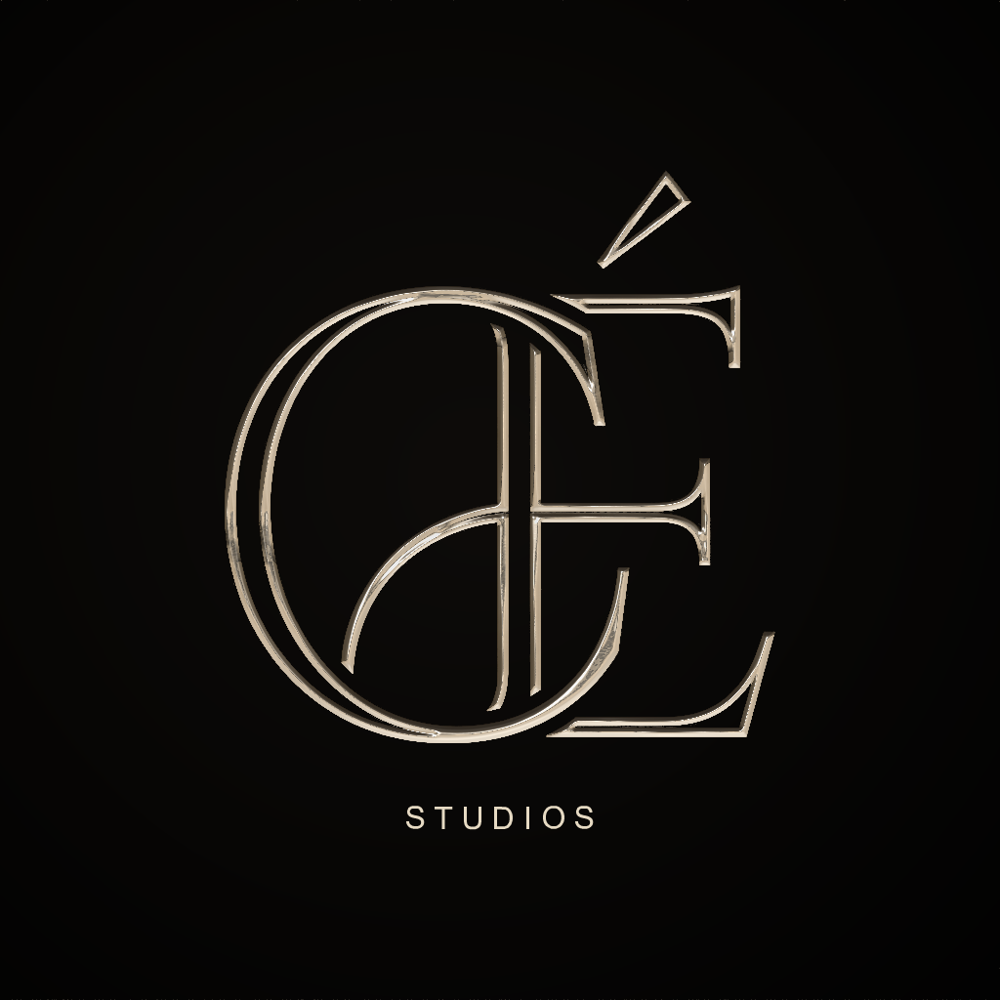
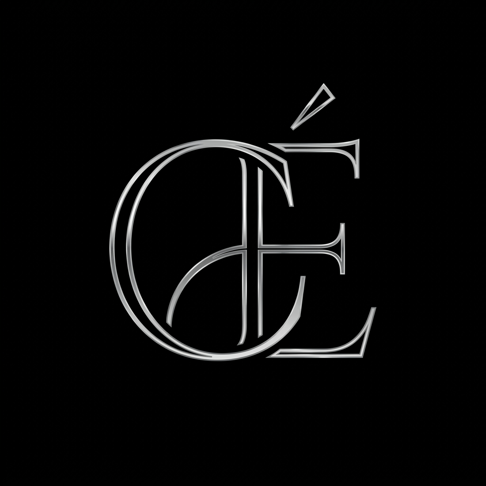
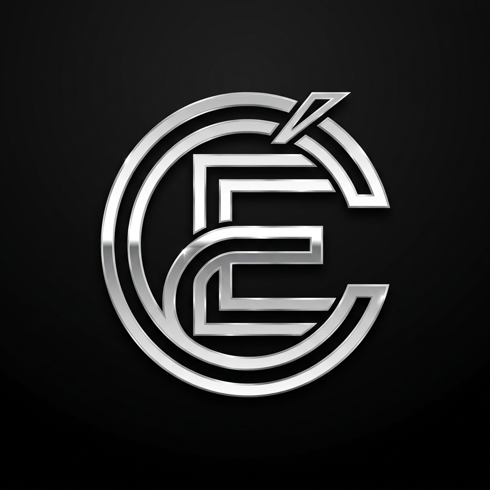
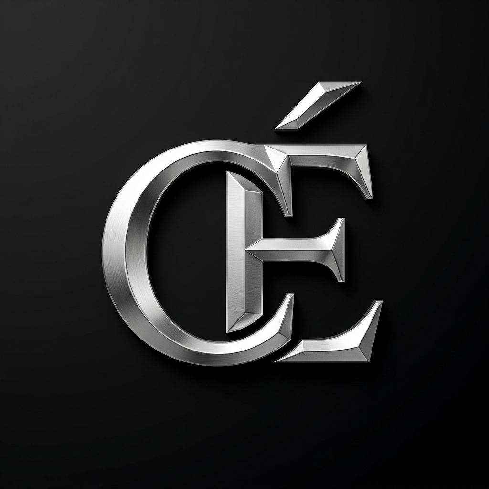
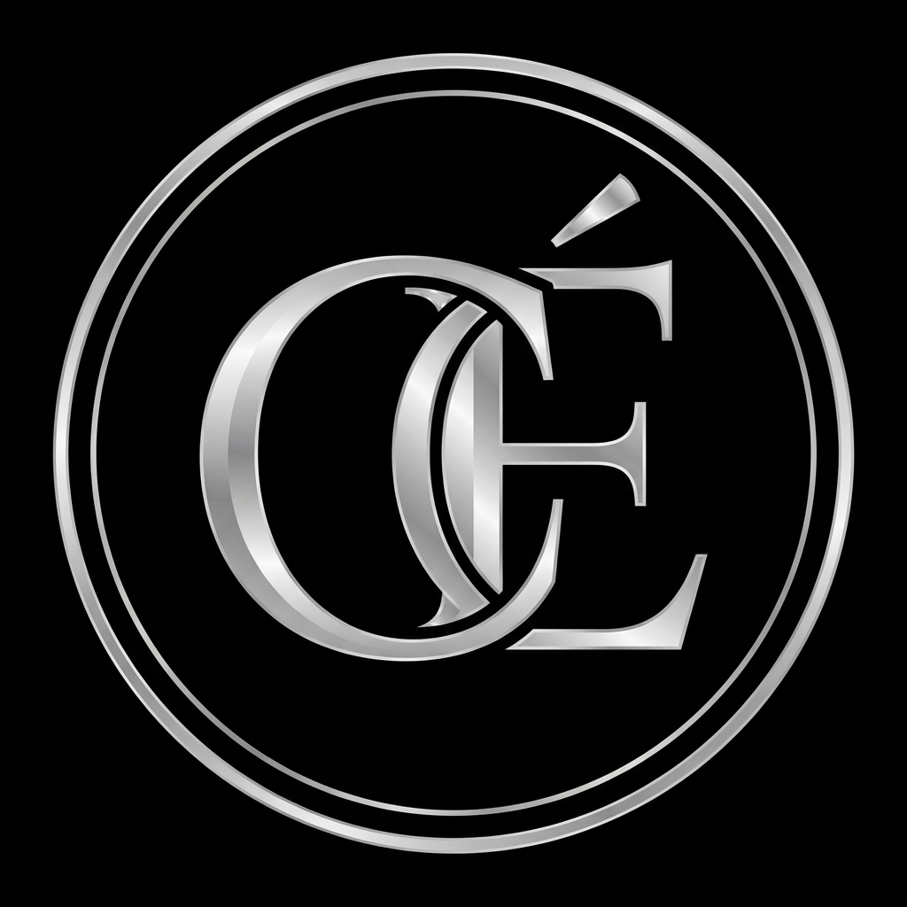
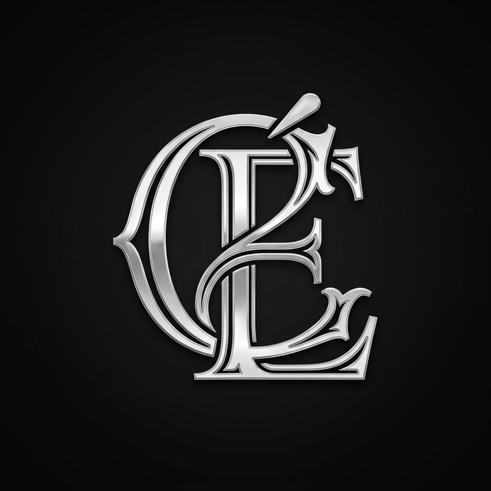
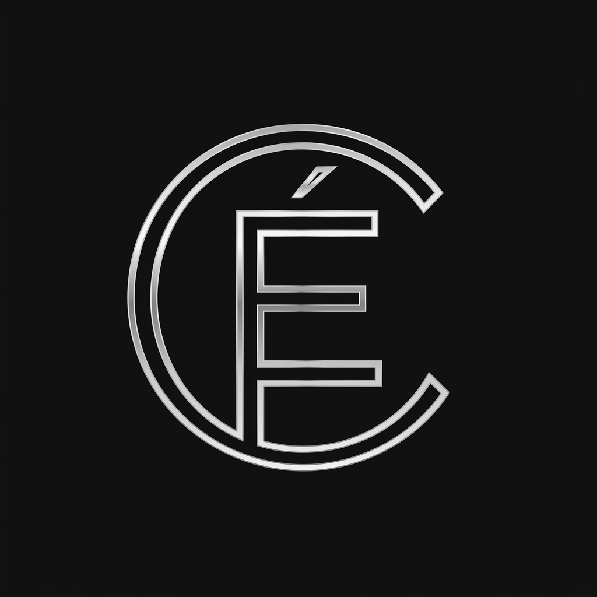

# CÉ Studios — Brand Identity Lookbook

Hier ist die neue Kombination, die du gewünscht hast: das **ineinander verschlungene Monogramm von Bild 1** mit dem **spektakulären metallischen Specular-Glanz von Bild 2**.

---

### [NEU] Konzept 18: Das verschlungene Monogramm mit Specular-Glanz

*Dieses Logo kombiniert die Form von Bild 1 (Concept 7) und den plastischen Silber-Chroma-Glanz von Bild 2.*

---

### Konzept 7: Silberne Monogramm-Verflechtung (Basis)

*Klassische, fließende silberne Monogrammlinien im High-Fashion-Stil.*

---

### Konzept 10: Polierter Chrome-Doppelstrich

*Edle Doppelkonturlinien mit glänzendem Chrom-Effekt.*

---

### Konzept 11: Platin-Silber mit Kantenschliff (3D)

*Dreidimensionaler Kantenschliff für plastische Prägung.*

---

### Konzept 12: Silber-Monogramm mit Doppelring

*Das verflochtene Monogramm umgeben von einem feinen doppelten Kreisrahmen.*

---

### Konzept 13: Serif-Monogramm mit Doppelkontur

*Klassische, elegante Serifenschrift-Formen mit edler Doppelkontur.*

---

### Konzept 14: Nadelfeine Doppelkontur-Linien

*Hauchzarte, messerscharfe doppelte Linienführung (Saint Laurent Vibe).*
